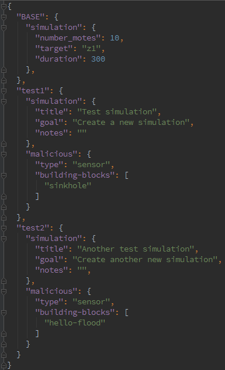
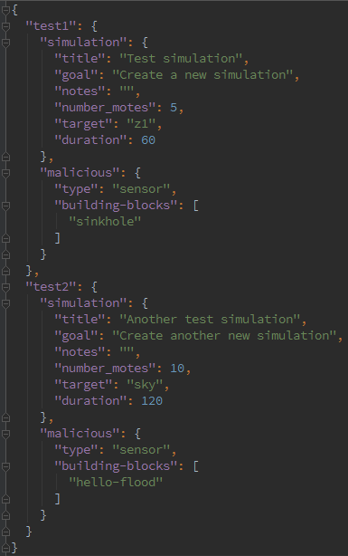

[](https://travis-ci.org/dhondta/rpl-attacks)
[](https://zenodo.org/badge/latestdoi/22624/dhondta/rpl-attacks)

# RPL Attacks Framework

* auto-gen TOC:
{:toc}

This project is aimed to provide a simple and convenient way to generate simulations and deploy malicious motes for a Wireless Sensor Network (WSN) that uses Routing Protocol for Low-power and lossy devices (RPL) as its network layer.

With this framework, it is possible to easily define campaign of simulations either redefining RPL configuration constants, modifying single lines from the ContikiRPL library or using an own external RPL library. Moreover, experiments in a campaign can be generated either based on a same or a randomized topology for each simulation.

### A few test cases made with the framework:

#### Test case 1: flooding attack

The malicious mote has 3, 7, 10 in its range                               |  Power tracking without the malicious mote                                                |  Power tracking with the malicious mote
:-------------------------------------------------------------------------:|:-----------------------------------------------------------------------------------------:|:------------------------------------------------------------------------------------:
 |  | 

#### Test case 2: versioning attack

Legitimate DODAG                                         |  Versioning attack in action (global repair)
:-------------------------------------------------------:|:-----------------------------------------------------:
 | 

Power tracking without the malicious mote                          |  Power tracking with the malicious mote
:-----------------------------------------------------------------:|:---------------------------------------------------------------:
 | 

#### Test case 3a: blackhole attack

Legitimate DODAG                                               |  Blackhole attack in action
:-------------------------------------------------------------:|:-----------------------------------------------------------:
 | 

#### Test case 3b: blackhole attack

Legitimate DODAG                                               |  Blackhole attack in action
:-------------------------------------------------------------:|:-----------------------------------------------------------:
 | 


## System Requirements

This framework was tested on an **InstantContiki** appliance (that is, an Ubuntu 14.04).

It was tested with **Python 2 and 3**.


## Installation

1. Clone this repository

 ```
 git clone https://github.com/dhondta/rpl-attacks.git
 ```
 
 > **Behind a proxy ?**
 > 
 > Setting: `git config --global http.proxy http://[user]:[pwd]@[host]:[port]`
 > 
 > Unsetting: `git config --global --unset http.proxy`
 > 
 > Getting: `git config --global --get http.proxy`

2. Install system requirements

 ```
 sudo apt-get install gfortran libopenblas-dev liblapack-dev
 sudo apt-get install python-numpy python-scipy
 sudo apt-get install imagemagick libcairo2-dev libffi-dev
 ```

 > **Behind a proxy ?**
 > 
 > Do not forget to configure your Network system settings (or manually edit `/etc/apt/apt.conf`).
 
   If not using InstantContiki appliance, also install :

 ```
 sudo apt-get install build-essential binutils-msp430 gcc-msp430 msp430-libc msp430mcu mspdebug binutils-avr gcc-avr gdb-avr avr-libc avrdude openjdk-7-jdk openjdk-7-jre ant libncurses5-dev lib32ncurses5
 ```

3. Install Python requirements

 ```
 sudo apt-get install python-pip
 sudo pip install -r requirements.txt
 ```

 or

 ```
 sudo apt-get install python3-pip
 sudo pip3 install -r requirements.txt
 ```

 > **Behind a proxy ?**
 > 
 > Do not forget to add option `--proxy=http://[user]:[pwd]@[host]:[port]` to your pip command.
 
4. Setup dependencies and test the framework

 ```
 ../rpl-attacks$ fab test
 ```


## Non-Standard Configuration

**This section only applies if you want to tune Contiki's source folder and/or your experiments folder.**

Create a default configuration file

 ```
 ../rpl-attacks$ fab config
 ```

 or create a configuration file with your own parameters (respectively, *contiki_folder* and *experiments_folder*)

 ```
 ../rpl-attacks$ fab config:/opt/contiki,~/simulations
 ```

Parameters :

- `contiki_folder`: the path to your contiki installation

>  [default: ~/contiki]

- `experiments_fodler`: the path to your experiments folder

>  [default: ~/Experiments]

These parameters can be later tuned by editing ``~/.rpl-attacks.conf``. These are written in a section named "RPL Attacks Framework Configuration".

Example configuration file :

```
[RPL Attacks Framework Configuration]
contiki_folder = /opt/contiki
experiments_folder = ~/simulations
```


## Quick Start (using the integrated console)

1. Open the console (you should see something like in the following screenshot)

 ```
 ../rpl-attacks$ fab console
 ```

 or

 ```
 ../rpl-attacks$ python main.py
 ```

 or

 ```
 ../rpl-attacks$ python3 main.py
 ```

 

2. Create a campaign of simulations

 ```
 user@instant-contiki:rpl-attacks>> prepare sample-attacks
 ```

3. Go to your experiments folder (default: `~/Experiments`) and edit your new `sample-attacks.json` to suit your needs

  See  for more information.

4. Make the simulations

 ```
 user@instant-contiki:rpl-attacks>> make_all sample-attacks
 ```

5. Run the simulations (multi-processed)

 ```
 user@instant-contiki:rpl-attacks>> run_all sample-attacks
 ```

  **Hint** : You can type ``status`` during ``make_all`` and ``run_all`` processing for getting the status of pending tasks.

6. Once tasks are in status ``SUCCESS`` in the status tables (visible by typing ``status``), just go to the experiment's ``results`` folders to get pictures and logs of the simulations. The related paths are the followings :

 ``[EXPERIMENTS_FOLDER]/[experiment_name]/without-malicious/results/``
 ``[EXPERIMENTS_FOLDER]/[experiment_name]/with-malicious/results/``


## Quick Start (using `fabric`)

1. Create a simulation campaign file from the template

 ```
 ../rpl-attacks$ fab prepare:test-campaign
 ```

2. Edit the simulation campaign file to suit your needs

3. Create the simulations

 ```
 ../rpl-attacks$ fab make_all:test-campaign
 ```

4. Run the simulations (not multi-processed)

 ```
 ../rpl-attacks$ fab run_all:test-campaign
 ```

5. Once done, just go to the experiment's ``results`` folders to get pictures and logs of the simulations. The related paths are the followings :

 ``[EXPERIMENTS_FOLDER]/[experiment_name]/without-malicious/results/``
 ``[EXPERIMENTS_FOLDER]/[experiment_name]/with-malicious/results/``


## Commands

Commands are used by typing **``fab [command here]``** (e.g. ``fab launch:hello-flood``) or in the framework's console (e.g. ``launch hello-flood``).

- **`build`**`name`

> This will the malicious mote from the simulation directory named 'name' and upload it to the target hardware.

- **`clean`**`name`

> This will clean the simulation directory named 'name'.

- **`config`**`[contiki_folder, experiments_folder`]

> This will create a configuration file with the given parameters at `~/.rpl-attacks.conf`.
>
>  `contiki_folder`: path to Contiki installation [default: ~/contiki]
>
>  `experiments_folder`: path to your experiments [default: Experiments]

- **`cooja`**`name[, with-malicious-mote]`

> This will open Cooja and load simulation named 'name' in its version with or without the malicious mote.
>
>  `with-malicious-mote`: flag for starting the simulation with/without the malicious mote [default: false]

- **`drop`**`simulation-campaign-json-file`

> This will remove the campaign file named 'simulation-campaign-json-file'.

- **`list`**`type-of-item`

> This will list all existing items of the specified type from the experiment folder.
>
>  `type-of-item`: `experiments` or `campaigns`

- **`make`**`name[, n, ...]`

> This will create a simulation named 'name' with specified parameters and also build all firmwares from ``root.c``, ``sensor.c`` and ``malicious.c`` templates with the specified target mote type. This can alternatively make the malicious mote with an external library by providing its path.
>
>  `n`: number of sensors (excluding the root and malicious motes)
>
>  `duration`: simulation duration in seconds
>
>  `title`: simulation title
>
>  `goal`: simulation goal (displayed in the Notes pane)
>
>  `notes`: simulation notes (appended behind the goal in the Notes pane)
>
>  `min_range`: malicious mote's maximum range from the root
>
>  `tx_range`: transmission range
>
>  `int_range`: interference range
>
>  `area_side`: side of the square area of the WSN
>
>  `mtype_root`: root mote type
>
>  `mtype_sensor`: sensor mote type
>
>  `mtype_malicious`: malicious mote type
>
>  `malicious_target`: external RPL library for building the malicious mote
>
>  `blocks`: building blocks for building the malicious mote, as defined in `./templates/building-blocks.json`
>
>  `ext_lib`: external RPL library for building the malicious mote

- **`make_all`**`simulation-campaign-json-file`

> This will generate a campaign of simulations from a JSON file.

- **`prepare`**`simulation-campaign-json-file`

> This will generate a campaign JSON file from the template located at `./templates/experiments.json`.

- **`remake_all`**`simulation-campaign-json-file`

> This will re-generate malicious motes for a campaign of simulations from the selected malicious mote template (which can then be modified to refine only the malicious mote without re-generating the entire campaign).

- **`run`**`name`

> This will execute the given simulation, parse log files and generate the results.

- **`run_all`**`simulation-campaign-json-file`

> This will run the entire simulation campaign.

- **`setup`**

> This will setup Contiki, Cooja and upgrade `msp430-gcc` for RPL Attacks.

- **`status`**

> This will show the status of current multi-processed tasks.

- **`test`**

> This will test the framework.


## Simulation campaign

Example JSON for a campaign with a BASE simulation as a template for the other simulations (with the same topology) :

 

Example JSON for a campaign of heterogeneous simulations (with randomized topologies) :

 
