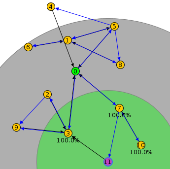
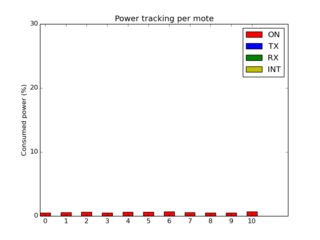
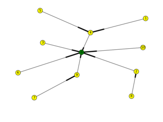
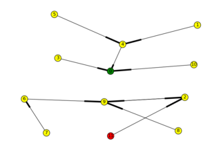
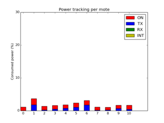
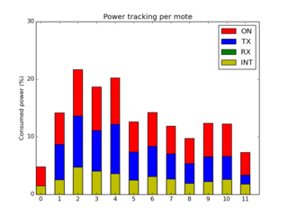
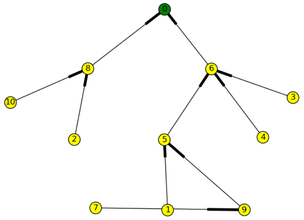
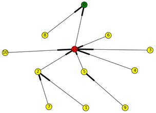
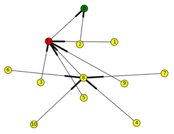

[](https://travis-ci.org/dhondta/rpl-attacks)
[](https://rpl-attacks.readthedocs.io/en/latest/?badge=latest)
[](https://snyk.io/test/github/dhondta/rpl-attacks?targetFile=requirements.txt)
[](https://requires.io/github/dhondta/rpl-attacks/requirements/?branch=master)
[](https://zenodo.org/badge/latestdoi/22624/dhondta/rpl-attacks)
[](https://www.blackhat.com/eu-18/arsenal/schedule/index.html#rpl-attacks-framework-attacking-rpl-in-wsns-12671)
[](https://app.vagrantup.com/dhondta/boxes/rpl-attacks)
[](https://pypi.python.org/pypi/sploitkit/)
[](https://beerpay.io/dhondta/rpl-attacks)
[](https://www.paypal.me/dhondta)


## Table of Contents

   * [RPL Attacks Framework](#rpl-attacks-framework)
   * [System Requirements](#system-requirements)
   * [Quick Installation](#quick-installation)
   * [Demonstration](#demonstration)
   * [Quick Start (using the integrated console)](#quick-start-using-the-integrated-console)
   * [Quick Start (using `fabric` only)](#quick-start-using-fabric-only)
   * [Issues management](#issues-management)

**Note**: In case of problem, please refer to *[Issues management](#issues-management)* first !

# RPL Attacks Framework

This project is aimed to provide a simple and convenient way to generate simulations and deploy malicious motes for a Wireless Sensor Network (WSN) that uses Routing Protocol for Low-power and lossy devices (RPL) as its network layer.

With this framework, it is possible to easily define campaign of simulations either redefining RPL configuration constants, modifying single lines from the ContikiRPL library or using an own external RPL library. Moreover, experiments in a campaign can be generated either based on a same or a randomized topology for each simulation.

## 

### A few test cases made with the framework:

#### Test case 1: flooding attack

The malicious mote has 3, 7, 10 in its range                               |  Power tracking without the malicious mote                                                |  Power tracking with the malicious mote
:-------------------------------------------------------------------------:|:-----------------------------------------------------------------------------------------:|:------------------------------------------------------------------------------------:
 |  | 

#### Test case 2: versioning attack

Legitimate DODAG                                         |  Versioning attack in action (global repair)
:-------------------------------------------------------:|:-----------------------------------------------------:
 | 

Power tracking without the malicious mote                          |  Power tracking with the malicious mote
:-----------------------------------------------------------------:|:---------------------------------------------------------------:
 | 

#### Test case 3a: blackhole attack

Legitimate DODAG                                               |  Blackhole attack in action
:-------------------------------------------------------------:|:-----------------------------------------------------------:
 | 

#### Test case 3b: blackhole attack

Legitimate DODAG                                               |  Blackhole attack in action
:-------------------------------------------------------------:|:-----------------------------------------------------------:
 | 


## Quick Installation

1. Clone this repository

 ```
 $ git clone https://github.com/dhondta/rpl-attacks.git
 ```
 
 > **Behind a proxy ?**
 > 
 > Setting: `git config --global http.proxy http://[user]:[pwd]@[host]:[port]`
 > 
 > Unsetting: `git config --global --unset http.proxy`
 > 
 > Getting: `git config --global --get http.proxy`

2. Create the VM

 ```
 $ vagrant login
 [...]
 $ vagrant up
 ```
 
 > **Important notes**
 > 
 > The downloads of the Vagrant box may take a while, please be patient...
 > 
 > Also, after the creation of the VM, Vagrant may complain that the *SSH connection was unexpectedly closed by the remote end*. In practice, this does not affect the creation and operation of the box.
 
 > **Behind a proxy ?**
 > 
 > Install the plugin: `vagrant plugin install vagrant-proxyconf`
 > 
 > Configure Vagrant: Uncomment the lines starting with `config.proxy` in the `Vagrantfile`

 > **Troubleshooting**:
 > 
 > - Ensure the latest version of Vagrant is installed
 > - If using `virtualbox` provider, ensure Oracle Extension Pack is installed (see [Oracle website](https://www.google.be/#q=virtualbox+oracle+extension+pack+install))


## Demonstration

This will make 3 complete examples of attacks : hello flood, version number and blackhole.

Open the console like before and type:

 ```
 user@instant-contiki:rpl-attacks>> demo
 ```

Or simply launch the `demo` command with Fabric:

 ```
 ./rpl-attacks$ fab demo
 ```


## Quick Start (using the integrated console)

1. Open the console (you should see something like in the following screenshot)

 ```
 ./rpl-attacks$ fab console
 ```

 or

 ```
 ./rpl-attacks$ python main.py
 ```

 or

 ```
 ./rpl-attacks$ python3 main.py
 ```

 

2. Create a campaign of simulations

 ```
 user@instant-contiki:rpl-attacks>> prepare sample-attacks
 ```

3. Go to your experiments folder (default: `~/Experiments`) and edit your new `sample-attacks.json` to suit your needs

  See [*How to create a campaign of simulations ?*](doc/create-campaigns.md) for more information.

4. Make the simulations

 ```
 user@instant-contiki:rpl-attacks>> make_all sample-attacks
 ```

5. Run the simulations (multi-processed)

 ```
 user@instant-contiki:rpl-attacks>> run_all sample-attacks
 ```

  **Hint** : You can type ``status`` during ``make_all`` and ``run_all`` processing for getting the status of pending tasks.

6. Once tasks are in status ``SUCCESS`` in the status tables (visible by typing ``status``), just go to the experiment's ``results`` folders to get pictures and logs of the simulations. The related paths are the followings :

 ``[EXPERIMENTS_FOLDER]/[experiment_name]/without-malicious/results/``
 ``[EXPERIMENTS_FOLDER]/[experiment_name]/with-malicious/results/``


## Quick Start (using `fabric` only)

1. Create a simulation campaign file from the template

 ```
 ./rpl-attacks$ fab prepare:test-campaign
 ```

2. Edit the simulation campaign file to suit your needs

3. Create the simulations

 ```
 ./rpl-attacks$ fab make_all:test-campaign
 ```

4. Run the simulations (not multi-processed)

 ```
 ./rpl-attacks$ fab run_all:test-campaign
 ```

5. Once done, just go to the experiment's ``results`` folders to get pictures and logs of the simulations. The related paths are the followings :

 ``[EXPERIMENTS_FOLDER]/[experiment_name]/without-malicious/results/``
 ``[EXPERIMENTS_FOLDER]/[experiment_name]/with-malicious/results/``

 
## Issues management

In case of bug, there should be a **crash report generated in the folder of the experiment** that the framework was processing. By convention, this is named **`crash-report-[...].txt`**. Please copy its content (without the title) in a [new Issue](https://github.com/dhondta/rpl-attacks/issues/new).
 
For contributions or suggestions, please [open an Issue](https://github.com/dhondta/rpl-attacks/issues/new) and clearly explain, using an example or a use case if appropriate. 

If you want to build new RPL attacks, please refer to the [*How to make new building blocks ?*](https://github.com/dhondta/rpl-attacks/blob/master/doc/building-blocks.md) section. In this case, please submit your new attack through a Pull Request.
