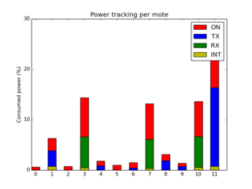

This project aims to provide a simple and convenient way to generate simulations and deploy malicious motes for a Wireless Sensor Network (WSN) that uses Routing Protocol for Low-power and lossy devices (RPL) as its network layer.

With this framework, it is possible to easily define campaign of simulations either redefining RPL configuration constants, modifying single lines from the ContikiRPL library or using an own external RPL library. Moreover, experiments in a campaign can be generated either based on a same or a randomized topology for each simulation.

## Literature

This framework is based on an academical project that occured in 2016 in the scope of a course of *Mobile and Embedded Devices*.

Here is its current literature:
- [Academical report](report.pdf)

## Objectives

1. Automate the process of creating a simulation with Contiki's simulation tool Cooja
2. Provide a convenient way to generate campaigns of simulations so that attacks can be experimentally validated
3. Allow the user to create new attacks and building blocks
4. Provide an interface for building the actual malicious sensor

## Test Cases

The following subsections show a few test cases already implemented in the current version of the framework. These attacks are available in a predefined simulation campaign file (`examples/rpl-attacks.json`).

### Flooding Attack

The malicious mote has 3, 7, 10 in its range                               |  Power tracking without the malicious mote                                                |  Power tracking with the malicious mote
:-------------------------------------------------------------------------:|:-----------------------------------------------------------------------------------------:|:------------------------------------------------------------------------------------:
 |  | 

### Versioning Attack

Legitimate DODAG                                         |  Versioning attack in action (global repair)
:-------------------------------------------------------:|:-----------------------------------------------------:
 | 

Power tracking without the malicious mote                          |  Power tracking with the malicious mote
:-----------------------------------------------------------------:|:---------------------------------------------------------------:
 | 

### Blackhole Attack

Legitimate DODAG                                               |  Blackhole attack in action
:-------------------------------------------------------------:|:-----------------------------------------------------------:
 | 

### Test case 3b: blackhole attack

Legitimate DODAG                                               |  Blackhole attack in action
:-------------------------------------------------------------:|:-----------------------------------------------------------:
 | 

